# FdF

**FdF** is a project from 42 School where we transform a file containing a grid of height values into a 3D wireframe using the MiniLibX graphics library. Think of it as turning numbers into art!

## Project Overview

The main goal of FdF is to read a file with height values arranged in a grid and render it as a stunning 3D wireframe model. We use the **MiniLibX** library to handle graphics rendering.

### Example

Here is an example of a small map file:

```
0  0  0  0  0  0  0  0  0  0
0 10 10 10 10 10 10 10 10  0
0 10 20 15 12 15 17 20 10  0
0 10 15 10 12 15 15 15 10  0
0  5 15 10 12 15 15 13 10  0
0  5 10  5  7 12 12 12 10  0
0  5  7  1  2  7  5  5  7  0
0  3  0  0  1  2  2  2  5  0
0  1  0  0  0  0  0  0  3  0
0  0  0  0  0  0  0  0  0  0
```

And here’s how it looks when rendered:

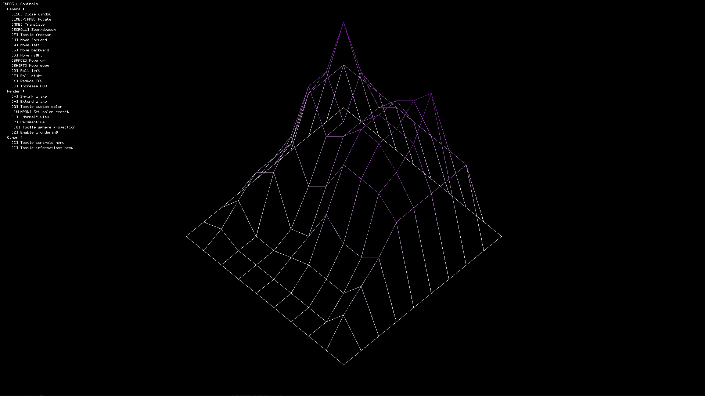

### Larger Maps in Action

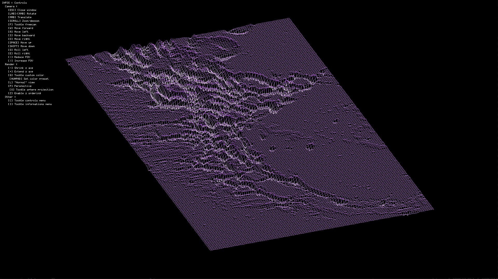
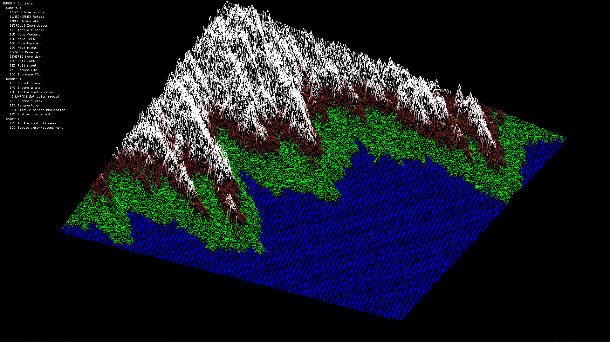
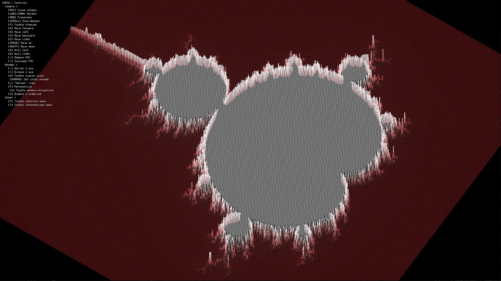
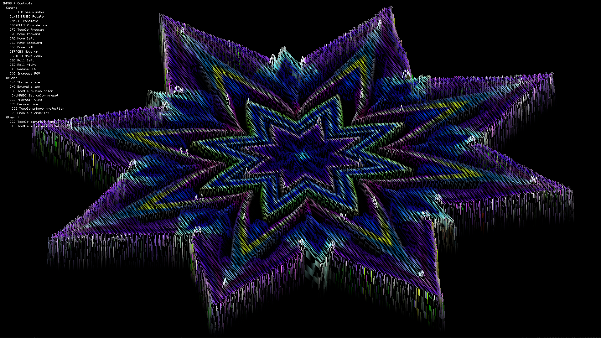

---

## Try It Yourself

Want to try FdF on your own? Follow these steps:  

1. Clone the repository and its submodules:
   ```bash
   git clone https://github.com/Liammmmmmmm/42-FdF.git
   ```
   Then initialize the submodules with:
   ```bash
   git submodule update --init --recursive
   ```

2. Build the project (fast flag is pretty important if you want it to be fluid on big maps):
   ```bash
   make fast
   ```

3. Run the program with a map file:
   ```bash
   ./fdf <map.fdf>
   ```

That’s it! You’re ready to explore your wireframe world. 🌟  

---

## Features

Because FdF isn't enough, I've added quite a lot of features, here are a lot of them:

### Controls & informations

Wondering what to do inside the window? Don’t worry—controls are displayed by default! You can hide them with `[C]`.

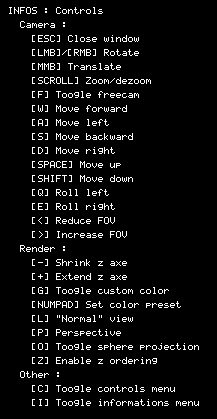

Need more details? Activate the real-time information panel with `[I]`. A lot of informations are here, enjoy nerds!

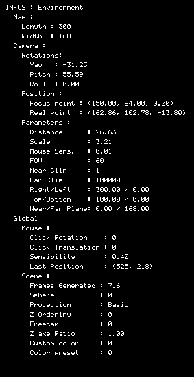

### Z-Axis Scaling

Some maps have exaggerated heights that look out of proportion. You can adjust the Z-axis scaling with `[-]` and `[+]`.

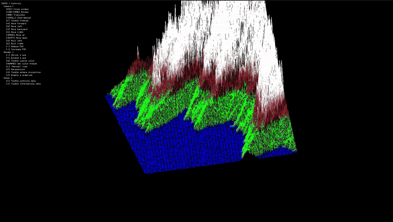


### Perspective Projection

Enable **perspective projection** for a more realistic 3D effect.

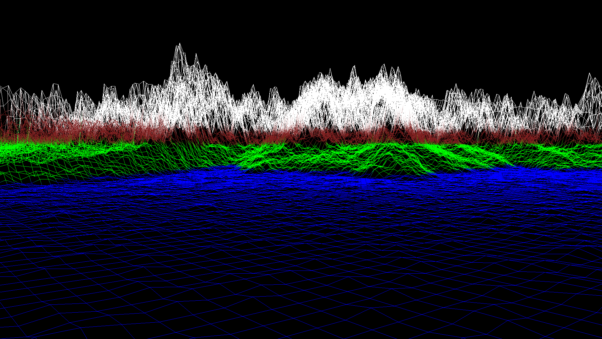

With perspective enabled, you can tweak parameters like the field of view (FOV) using `[<]` and `[>]`. The default FOV is 60.

### Free Camera Mode

Explore your wireframe in **free camera mode**! Move around the scene with the `WASD` keys for an immersive experience. It pairs beautifully with perspective mode.


### Z-ordering

By default, lines are drawn in the same order for every frame. This can cause visual glitches where lines that should be behind others appear in front. 
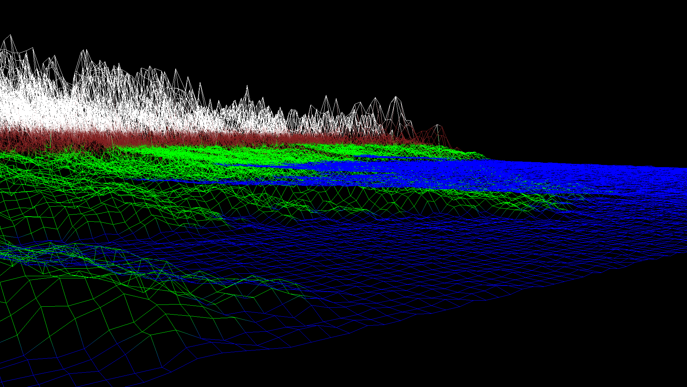

Toggle Z-ordering with [Z] to fix this issue. After numerous optimizations, the performance impact is minimal, so it is enabled by default.
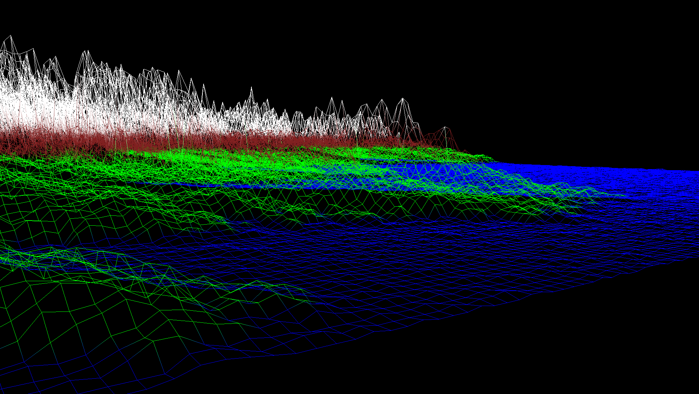

### Color Presets

Switch between various color presets to change the wireframe’s appearance. Use the numpad keys to select one of four presets:

1. **Default**: White at the lowest points, purple at the highest.
2. **Earth-like (smooth)**: Great for maps like `MGDS_WHOLE_WORLD_OCEAN1_M/L/XL.fdf`.
3. **Earth-like (non-smooth)**: Same as preset 2 but without smoothing.
4. **Moon-like**: Perfect for maps like `USGS_ULCN2005_grid.txt_OCEAN1_M/L.fdf`.

#### Earth Preset
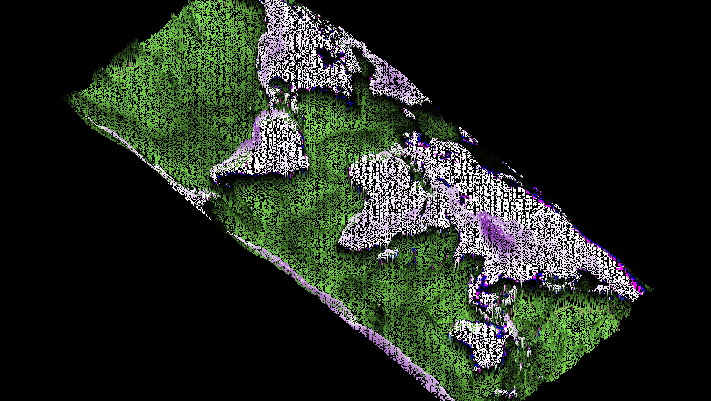

#### Moon Preset
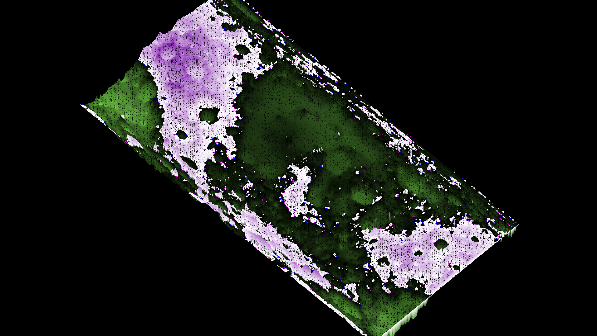

### Spherical Projection

Flat maps are boring! With my FdF, maps can become spherical for a more realistic touch. Science says the Earth is round, and so is ours. 🌍

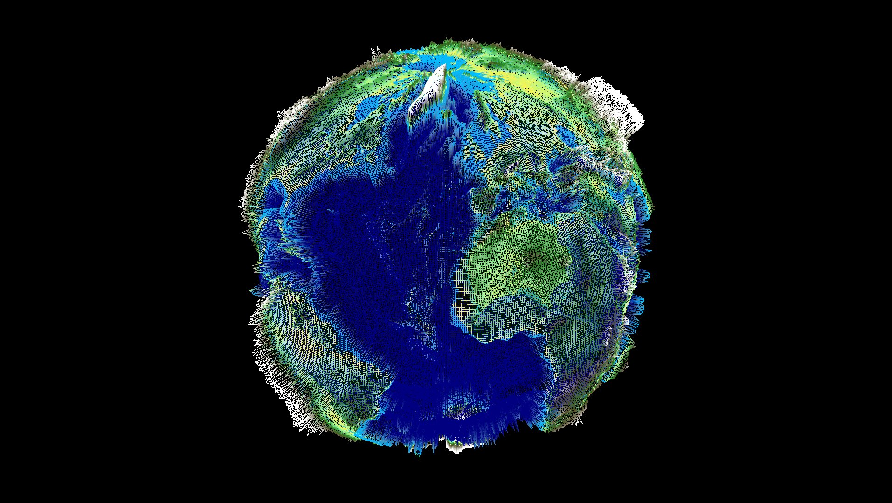 
(As you see we can also here play with the z-axe ratio)

This works for any map not just Earth. Check out the Moon in all its spherical glory:

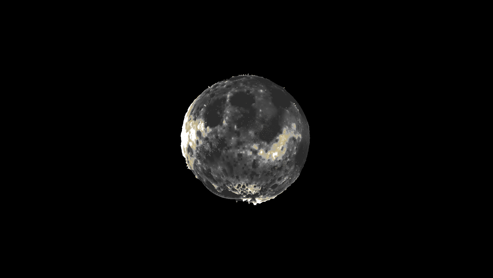 

### Adaptive Point Density

To optimize rendering and improve performance when zooming out, you can adjust the number of displayed points dynamically:
- Press `[K]` to increase the point spacing (display fewer points).
- Press `[J]` to decrease the point spacing (display more points).
- Press `[H]` to toggle **automatic adaptive density**, where point density adjusts based on camera distance (fewer points when zoomed out, more when zoomed in).


### Line Rendering Algorithms

Switch between different line rendering algorithms for varied visual effects:
- **Basic (default)**: A simple slope-based algorithm.
- **Wu’s Algorithm**: Provides anti-aliasing for smoother lines.
- **Bresenham’s Algorithm**: A precise, efficient integer-based method.

Press `[X]` to cycle through the available line rendering algorithms.

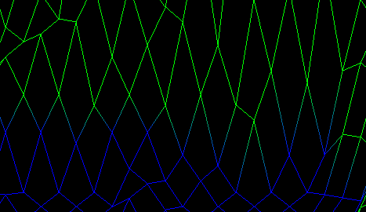
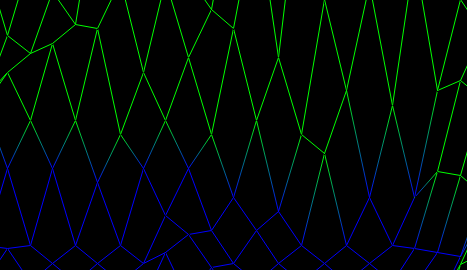

### Point Editing

You can modify the height of individual points in the wireframe:
- **Right-click** on a point to select it.
- Press `[N]` to increase its height by 1.
- Press `[B]` to decrease its height by 1.
- Press `[V]` to set its height to 0.

This feature allows for real-time modifications to the terrain, making adjustments intuitive and interactive.

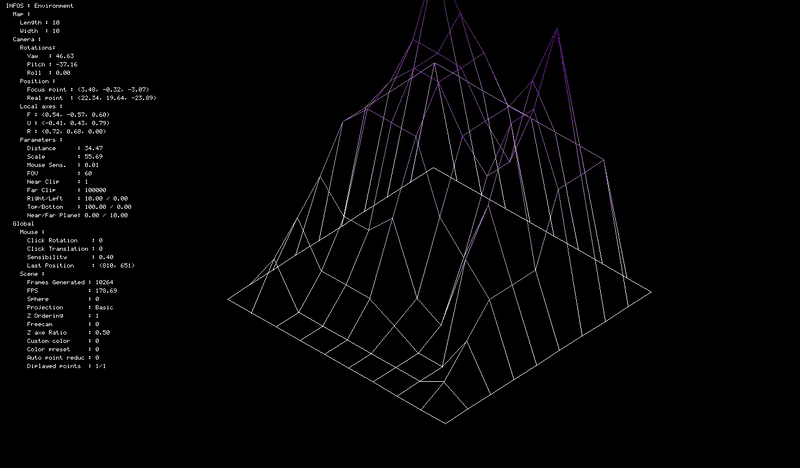

And because editing point 1 by 1 isn't really fun, you can also select multiples points by holding left control and right click

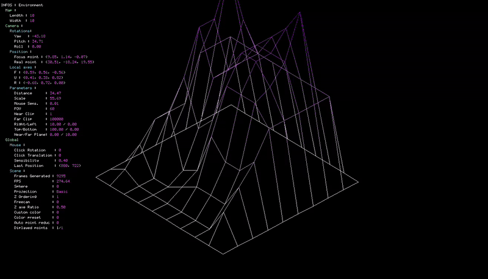

**And why limiting ourself at editing point height ?? You can now use [T] to enter in edit mode, you can paint and change point height from there.**

You can watch the youtube video if you want to see it with a good quality https://youtu.be/fW34TYyRYEc

 <!-- add gif later -->

### Multithreaded Rendering

To improve performance, line drawing and point projection calculations are now multithreaded, resulting in smoother frame rates even on large maps.

## Conclusion

**FdF** is an exciting project that teaches you file parsing tricks and how to project 3D points `(x, y, z)` onto a 2D screen. You’ll sharpen your matrix calculation skills and discover the joy of bringing numbers to life. With bonuses and extra features, this project becomes even more fun and rewarding.

Pick this project, dive in, and enjoy the ride!  
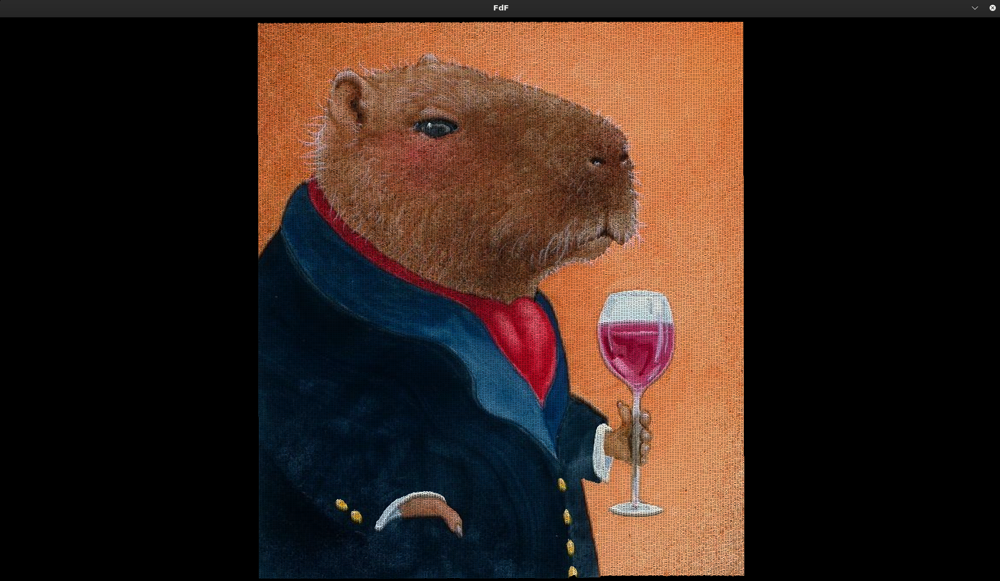

