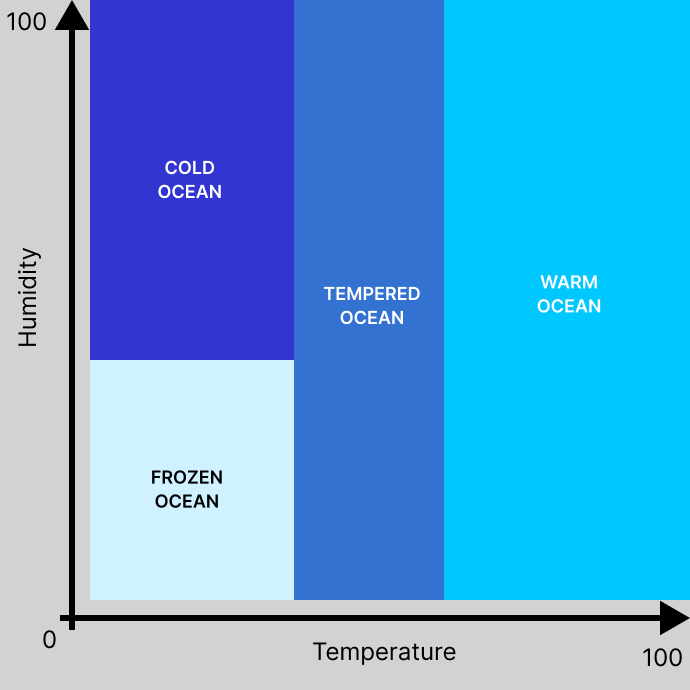

<p align='center'>
   <a href="https://www.linux.org/">
      </a>
   <a href="https://wakatime.com/badge/user/7d36b55a-b5ff-46c4-b7fd-57604568d382/project/1506d4b3-5b1c-46e7-93b4-8a636ce4e5d7">
      </a>
</p>

# FdF

**FdF** is a project from 42 School where we transform a file containing a grid of height values into a 3D wireframe using the MiniLibX graphics library. Think of it as turning numbers into art!

## Table of contents
- [Project Overview](#project-overview)
   - [Example](#example)
   - [Larger Maps in Action](#larger-maps-in-action)
- [Try It Yourself](#try-it-yourself)
- [Features](#features)
   - [Controls \& informations](#controls--informations)
   - [Z-Axis Scaling](#z-axis-scaling)
   - [Perspective Projection](#perspective-projection)
   - [Free Camera Mode](#free-camera-mode)
   - [Z-ordering](#z-ordering)
   - [Color Presets](#color-presets)
   - [Spherical Projection](#spherical-projection)
   - [Adaptive Point Density](#adaptive-point-density)
   - [Line Rendering Algorithms](#line-rendering-algorithms)
   - [Multithreaded Rendering](#multithreaded-rendering)
- [And Because FdF isn't enough](#and-because-fdf-isnt-enough)
   - [Point Editing](#point-editing)
   - [Procedural generation](#procedural-generation)
- [Conclusion](#conclusion)


## Project Overview

The main goal of FdF is to read a file with height values arranged in a grid and render it as a stunning 3D wireframe model. We use the **MiniLibX** library to handle graphics rendering.

### Example

Here is an example of a small map file:

```
0  0  0  0  0  0  0  0  0  0
0 10 10 10 10 10 10 10 10  0
0 10 20 15 12 15 17 20 10  0
0 10 15 10 12 15 15 15 10  0
0  5 15 10 12 15 15 13 10  0
0  5 10  5  7 12 12 12 10  0
0  5  7  1  2  7  5  5  7  0
0  3  0  0  1  2  2  2  5  0
0  1  0  0  0  0  0  0  3  0
0  0  0  0  0  0  0  0  0  0
```

And here’s how it looks when rendered:


### Larger Maps in Action


---

## Try It Yourself

Want to try FdF on your own? Follow these steps:  

1. Clone the repository and its submodules:
   ```bash
   git clone https://github.com/Liammmmmmmm/42-FdF.git
   ```
   Then initialize the submodules with:
   ```bash
   git submodule update --init --recursive
   ```

2. Build the project (fast flag is pretty important if you want it to be fluid on big maps):
   ```bash
   make fast
   ```

3. Run the program with a map file:
   ```bash
   ./fdf <map.fdf>
   ```

That’s it! You’re ready to explore your wireframe world. 🌟  

---

## Features

Because FdF isn't enough, I've added quite a lot of features, here are a lot of them:

### Controls & informations

Wondering what to do inside the window? Don’t worry—controls are displayed by default! You can hide them with `[C]`.


Need more details? Activate the real-time information panel with `[I]`. A lot of informations are here, enjoy nerds!


### Z-Axis Scaling

Some maps have exaggerated heights that look out of proportion. You can adjust the Z-axis scaling with `[-]` and `[+]`.


### Perspective Projection

Enable **perspective projection** for a more realistic 3D effect.


With perspective enabled, you can tweak parameters like the field of view (FOV) using `[<]` and `[>]`. The default FOV is 60.

### Free Camera Mode

Explore your wireframe in **free camera mode**! Move around the scene with the `WASD` keys for an immersive experience. It pairs beautifully with perspective mode.


### Z-ordering

By default, lines are drawn in the same order for every frame. This can cause visual glitches where lines that should be behind others appear in front. 


Toggle Z-ordering with [Z] to fix this issue. After numerous optimizations, the performance impact is minimal, so it is enabled by default.


### Color Presets

Switch between various color presets to change the wireframe’s appearance. Use the numpad keys to select one of four presets:

1. **Default**: White at the lowest points, purple at the highest.
2. **Earth-like (smooth)**: Great for maps like `MGDS_WHOLE_WORLD_OCEAN1_M/L/XL.fdf`.
3. **Earth-like (non-smooth)**: Same as preset 2 but without smoothing.
4. **Moon-like**: Perfect for maps like `USGS_ULCN2005_grid.txt_OCEAN1_M/L.fdf`.

#### Earth Preset


#### Moon Preset


### Spherical Projection

Flat maps are boring! With my FdF, maps can become spherical for a more realistic touch. Science says the Earth is round, and so is ours. 🌍

 
(As you see we can also here play with the z-axe ratio)

This works for any map not just Earth. Check out the Moon in all its spherical glory:

 

### Adaptive Point Density

To optimize rendering and improve performance when zooming out, you can adjust the number of displayed points dynamically:
- Press `[K]` to increase the point spacing (display fewer points).
- Press `[J]` to decrease the point spacing (display more points).
- Press `[H]` to toggle **automatic adaptive density**, where point density adjusts based on camera distance (fewer points when zoomed out, more when zoomed in).


### Line Rendering Algorithms

Switch between different line rendering algorithms for varied visual effects:
- **Basic (default)**: A simple slope-based algorithm.
- **Wu’s Algorithm**: Provides anti-aliasing for smoother lines.
- **Bresenham’s Algorithm**: A precise, efficient integer-based method.

Press `[X]` to cycle through the available line rendering algorithms.


### Multithreaded Rendering

To improve performance, line drawing and point projection calculations are now multithreaded, resulting in smoother frame rates even on large maps.

## And Because FdF isn't enough

### Point Editing

You can modify the height of individual points in the wireframe:
- **Right-click** on a point to select it.
- Press `[N]` to increase its height by 1.
- Press `[B]` to decrease its height by 1.
- Press `[V]` to reset its height to 0.

This feature allows for real-time modifications to the terrain, making adjustments intuitive and interactive.


And since editing points one by one isn't exactly fun, you can also select multiple points by holding **Left Control** and **Right-Clicking**.


**But why limit ourselves to just editing point heights?? Press `[T]` to enter Edit Mode, where you can paint and modify terrain heights dynamically!**

Want to see it in action? Watch the YouTube video in high quality: [Watch here](https://youtu.be/fW34TYyRYEc)

[](https://youtu.be/fW34TYyRYEc)

#### Tools

1. **Sliders**
   - **Intensity:**
     - 100% applies the selected color (OR raises/lowers the point by 10, OR flattens it to 0).
     - 50% applies the selected color with 50% opacity (OR raises/lowers the point by 5, OR flattens it to 50% of its current height).
     - etc.
   - **Brush Radius:**
     - Adjusts the brush size for painting/editing larger or smaller areas. You can also modify it with `CTRL + MOUSE UP/DOWN`.

2. **Colors**
   - Click on a color to select it. The brush size indicator will display the selected color.

3. **Point Height Adjustments**
   - **UP:** Increases point height based on intensity.
   - **DOWN:** Decreases point height based on intensity.
   - **FLATTEN:** Brings the point towards height 0, depending on intensity.
   - **SMOOTH UP:** Smooth the points and increase their height.
   - **SMOOTH DOWN:** Smooth the points. A lot of repeated smooth down will often result in a flat terrain.

4. **Save**
   - Enter a filename and save your work (folder paths are allowed, but the field has a character limit).

---

### Procedural generation

Another major feature! Using only pregenerated maps is pretty borring, so why not adding a procedural generation ?


> But, how does it work ?

The key element here is **Perlin noise**:


There are different types of Perlin noise, here are some examples.

If you want to understand how Perlin noise is generated, try to understand `procedural_generation/gen_perlin_noise.c`, or read this [Wikipedia article](https://en.wikipedia.org/wiki/Perlin_noise) for a clear and simple explanation.

> How Do We Create a Custom Map from These Noisy Images?

There isn't a single "correct" method, but here's how I approached it.

To generate the map, I first create **four Perlin noise layers**:
- **Global height map** – Defines mountains, oceans, and plains.
- **Temperature map** – Influences biome distribution.
- **Humidity map** – Influences biome distribution to.
- **Surface variation map** – Adds small terrain details.

Based on the first three layers, I determine the biome. If the global height indicates an ocean, the temperature and humidity decide between these four ocean biomes:



The same applies to plains:


And for mountains:


And the combinaison of everything give something like that :


Each biome applies different transformations to the global height map. For instance:
- **Mountains** get increased elevation and more height variation.
- **Frozen oceans** flatten all points to water level.
- **Deserts** get a dune like effect.

And you can also appreciate more details like
- **Smooth transitions** between oceans biomes.
- **Details like flowers, rocks** to improve the tempered plain.

To make maps even more dynamic, I implemented rivers:
- Rivers **start in the mountains** and follow the slope **until they can't anymore**.

With all these elements combined, the generated maps look great! Each **seed** produces a unique world, and running the program twice with the same seed will generate **exactly the same map**.


## Conclusion

**FdF** is an exciting project that teaches you file parsing tricks and how to project 3D points `(x, y, z)` onto a 2D screen. You’ll sharpen your matrix calculation skills and discover the joy of bringing numbers to life. With bonuses and extra features, this project becomes even more fun and rewarding.

Pick this project, dive in, and enjoy the ride!  


