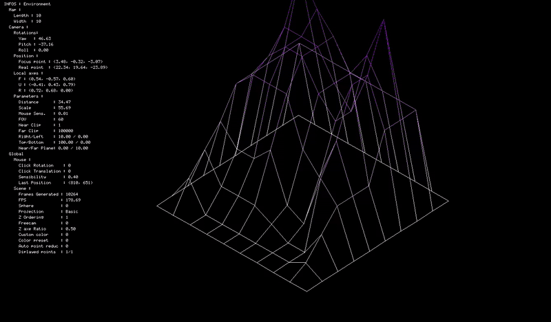

## Because FdF Isn't Enough

### Point Editing

You can modify the height of individual points in the wireframe:
- **Right-click** on a point to select it.
- Press `[N]` to increase its height by 1.
- Press `[B]` to decrease its height by 1.
- Press `[V]` to reset its height to 0.

This feature allows for real-time terrain modifications, making adjustments intuitive and interactive.

And since editing points one by one isn't exactly fun, you can also select multiple points by holding **Left Control** and **Right-Clicking**.

**But why limit ourselves to just editing point heights?? Press `[T]` to enter Edit Mode, where you can paint and modify terrain heights dynamically!**

Want to see it in action? Watch the YouTube video in high quality: [Watch here](https://youtu.be/fW34TYyRYEc)

### Tools

1. **Sliders**
   - **Intensity:**
     - 100% applies the selected color (OR raises/lowers the point by 10, OR flattens it to 0).
     - 50% applies the selected color with 50% opacity (OR raises/lowers the point by 5, OR flattens it to 50% of its current height).
     - etc.
   - **Brush Radius:**
     - Adjusts the brush size for painting/editing larger or smaller areas. You can also modify it with `CTRL + MOUSE UP/DOWN`.

2. **Colors**
   - Click on a color to select it. The brush size indicator will display the selected color.

3. **Point Height Adjustments**
   - **UP:** Increases point height based on intensity.
   - **DOWN:** Decreases point height based on intensity.
   - **FLATTEN:** Brings the point towards height 0, depending on intensity.

4. **Save**
   - Enter a filename and save your work (folder paths are allowed, but the field has a character limit).

---

### Procedural Generation

Another major feature! Creating maps manually can be tedious, so why not add **procedural generation**?

#### How Does It Work?

The key element here is **Perlin noise**:

There are different types of Perlin noise—here are some examples.

If you want to understand how Perlin noise is generated, check out `procedural_generation/gen_perlin_noise.c`, or read this [Wikipedia article](https://en.wikipedia.org/wiki/Perlin_noise) for a clear and simple explanation.

#### How Do We Create a Custom Map from These Noisy Images?

There isn't a single "correct" method, but here's how I approached it.

To generate the map, I first create **four Perlin noise layers**:
- **Global height map** – Defines mountains, oceans, and plains.
- **Temperature map** – Influences biome distribution.
- **Humidity map** – Affects vegetation and terrain types.
- **Surface variation map** – Adds small terrain details.

Based on the first three layers, I determine the biome. If the global height indicates an ocean, the temperature and humidity decide between these four ocean biomes:

The same applies to plains:

And for mountains:

### Combining Everything

Merging all these layers results in something like this:

### Adding Rivers

To make maps even more dynamic, I implemented rivers:
- Rivers **start in the mountains** and follow the slope **until they reach an ocean or lake**.

### The Final Result

With all these elements combined, the generated maps look great! Each **seed** produces a unique world, and running the program twice with the same seed will generate **exactly the same map**.

